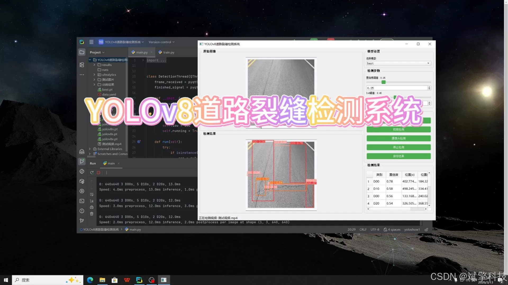
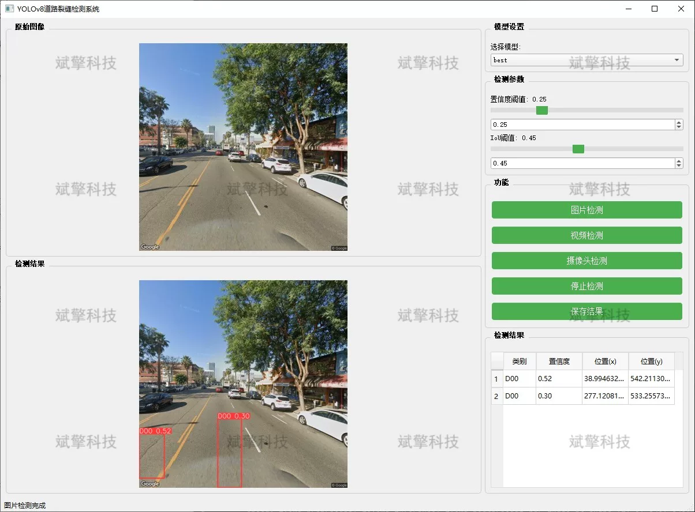
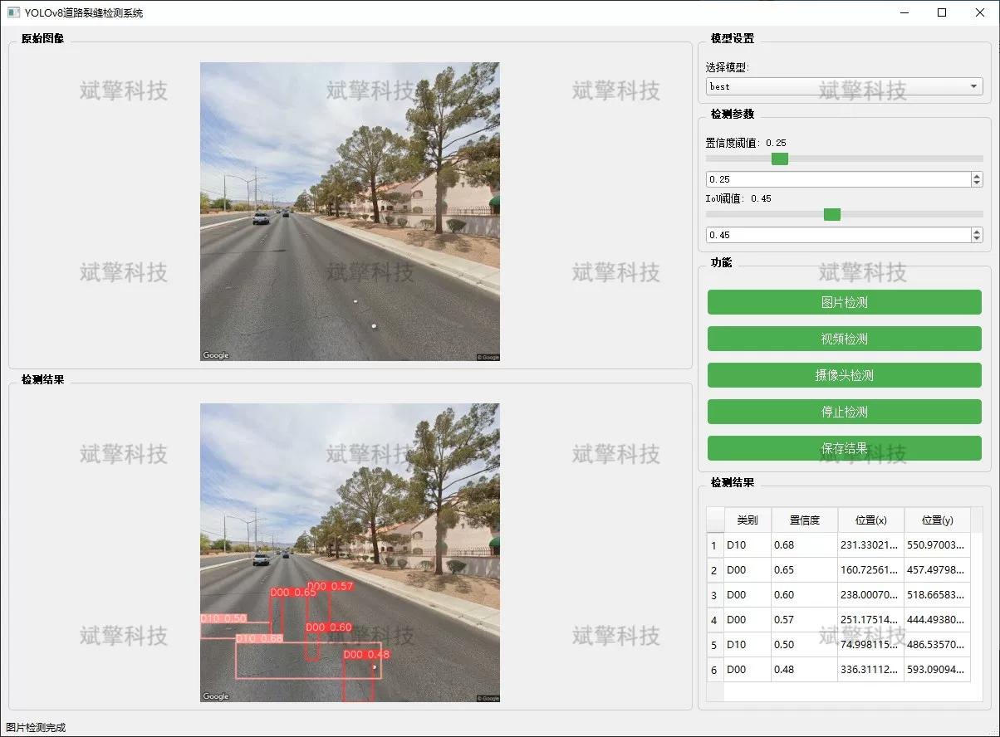
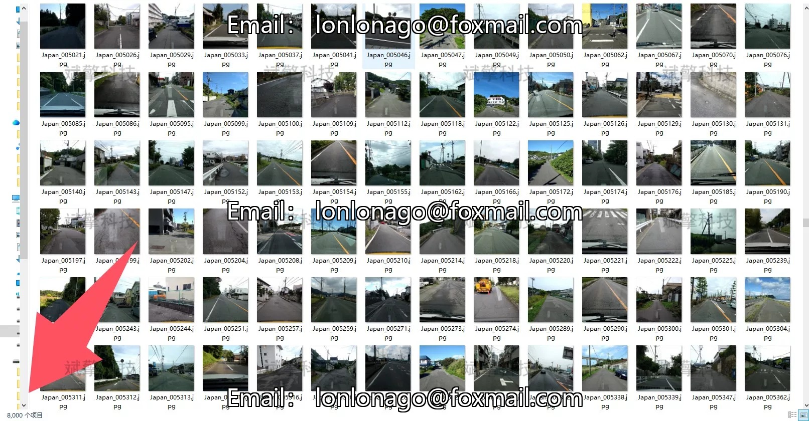
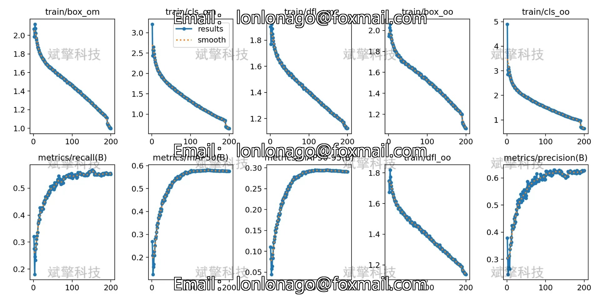
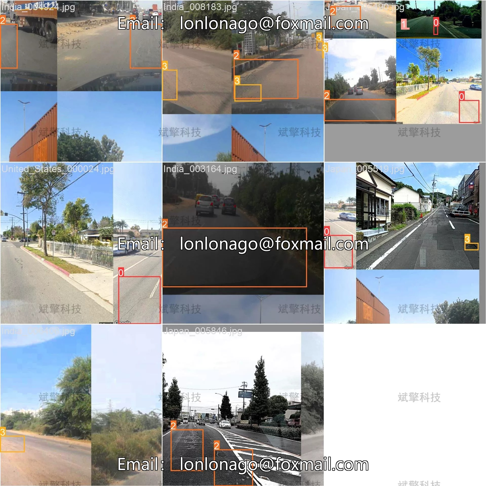
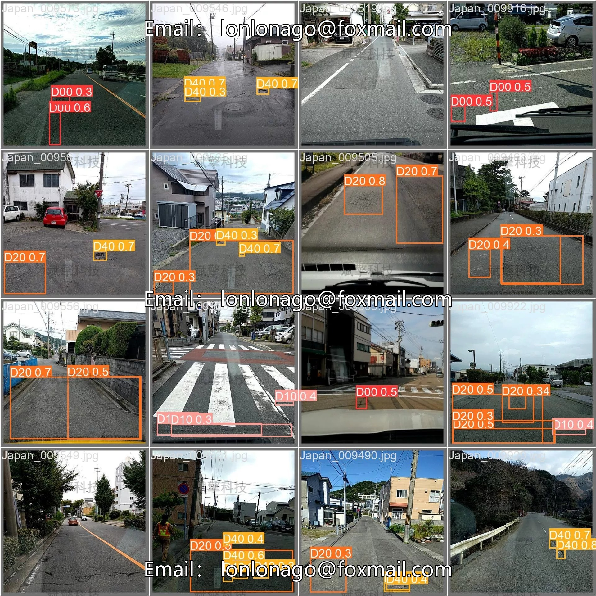

# Based on YOLOv8 Deep Learning Road Crack Detection System (YOLOv8+Y)

## Body

Based on the YOLOv8 deep learning algorithm, this project has developed a road crack detection system that is intelligent and can quickly and accurately identify road cracks. It aims to provide data support for road maintenance decisions.

Road cracks are the main manifestation of pavement diseases, and their early discovery and timely repair are significant for extending the lifespan of roads and ensuring traffic safety. In response to the issues of low efficiency and high missed rate in traditional manual inspections, this paper designs and implements a multi-functional intelligent road crack detection system based on the YOLOv8 target detection algorithm.

System Features
✅ Image Detection: Can detect images and return detection boxes and category information.
✅ Video Detection: Supports video file input, detecting the situation of each frame in videos.
✅ Real-time Camera Detection: Connects USB cameras to achieve real-time monitoring.
✅ Real-time parameter adjustment (confidence and IoU threshold)
Dataset Overview
Training set: 8000 images
Validation set: 2000 images

## Images

## Payment

Here is a pay link on Stripe ( https://buy.stripe.com/3cs8yP7sY87d0vu9AB ). Please contact me lonlonago@foxmail.com after funding $89, and I will send you a complete data files , thank you!

